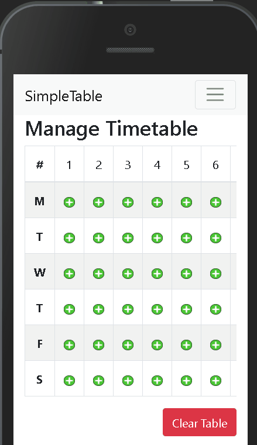

  

# Simple Table
Offline-first Progressive Web App(PWA) to manage your school timetable.

# Live demo
Check out the [live demo](https://simpletable.netlify.com/)

  

# Misc
Made using:

* [React.js](https://reactjs.org/)
* [bootstrap 4](https://getbootstrap.com/)
* [Redux](https://react-redux.js.org/)
* [Typescript](https://www.typescriptlang.org/index.html)

# License
[MIT](LICENSE)
